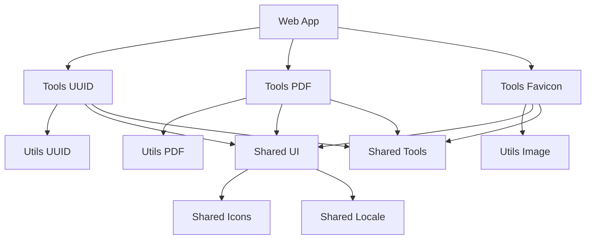

# InBrowser Web

A collection of browser-based tools built as a modern monorepo using Vue 3, TypeScript, and pnpm workspaces.

## Overview

InBrowser Web provides a suite of utility tools that run entirely in your browser, including UUID generators, PDF processors, favicon generators, and more. All tools are designed to work offline and protect your privacy by processing data locally.

## Project Structure

```
inbrowser-web/
├── apps/              # Main applications
├── shared/            # Shared packages and components
├── tools/             # Tool implementations
├── utils/             # Core business logic and algorithms
├── registry/          # Registry of tools
├── pnpm-workspace.yaml
└── package.json
```

### Directory Overview

- **[`apps/`](./apps/README.md)** - Main web application that serves the user interface
- **[`shared/`](./shared/README.md)** - Shared packages (UI components, icons, i18n, tool interfaces)
- **[`tools/`](./tools/README.md)** - Complete tool implementations with UI and routing
- **[`utils/`](./utils/README.md)** - Pure TypeScript utilities and algorithms
- **[`registry/`](./registry/README.md)** - Registry of tools

## Prerequisites

- Node.js >= 18.0.0
- pnpm >= 8.0.0

## Getting Started

1. **Install dependencies:**

   ```bash
   pnpm install
   ```

2. **Start development server:**

   ```bash
   pnpm dev
   ```

3. **Build for production:**
   ```bash
   pnpm build
   ```

## Available Scripts

- `pnpm dev` - Start the development server
- `pnpm build` - Build the web application for production
- `pnpm test` - Run tests across all packages
- `pnpm test:unit` - Run unit tests
- `pnpm test:e2e` - Run end-to-end tests
- `pnpm lint` - Run linting (oxlint + eslint)
- `pnpm format` - Format code with Prettier
- `pnpm type-check` - Run TypeScript type checking

## Architecture

### Monorepo Benefits

- **Code Sharing**: Shared components and utilities across tools
- **Consistent Dependencies**: Centralized dependency management
- **Type Safety**: Full TypeScript support with shared types
- **Atomic Changes**: Cross-package changes in single commits

### Package Structure



## Development Workflow

### Adding a New Tool

1. Create utility package in `utils/` for core logic
2. Create tool package in `tools/` for UI implementation
3. Export tool info using `@shared/tools` interface
4. Tool automatically appears in the main application

### Package Commands

- Run script in specific package: `pnpm -F <package-name> <script>`
- Add dependency to package: `pnpm -F <package-name> add <dependency>`
- Run script in all packages: `pnpm -r <script>`

## Key Features

- **🔒 Privacy First**: All processing happens locally in your browser
- **⚡ Fast**: Optimized for performance with modern web technologies
- **🌐 Offline Ready**: Most tools work without internet connection
- **📱 Responsive**: Works on desktop, tablet, and mobile devices
- **🎨 Modern UI**: Built with Vue 3 and Naive UI components
- **🌍 Internationalized**: Support for multiple languages
- **🔧 Developer Friendly**: Full TypeScript support and comprehensive testing

## Contributing

1. **Fork and clone** the repository
2. **Create a feature branch**: `git checkout -b feature/amazing-tool`
3. **Make your changes** following the existing patterns
4. **Run tests**: `pnpm test`
5. **Run linting**: `pnpm lint`
6. **Submit a pull request**

## License

This project is licensed under the MIT License - see the [LICENSE](LICENSE) file for details.
